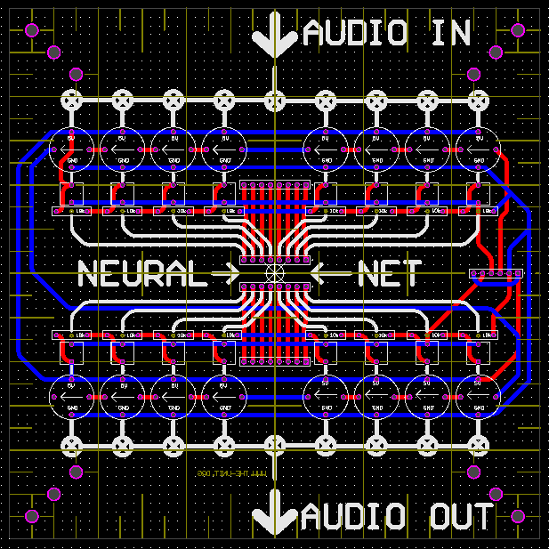
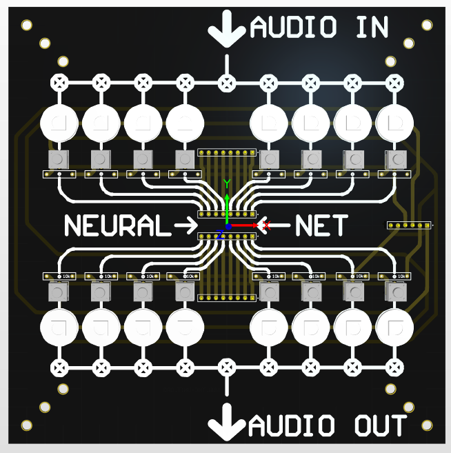
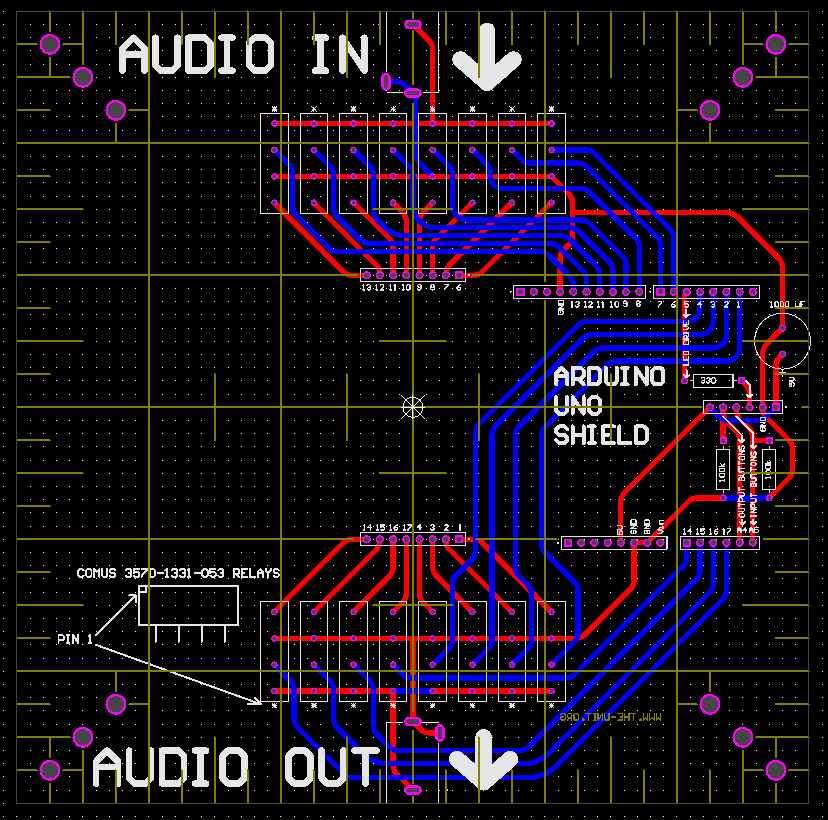
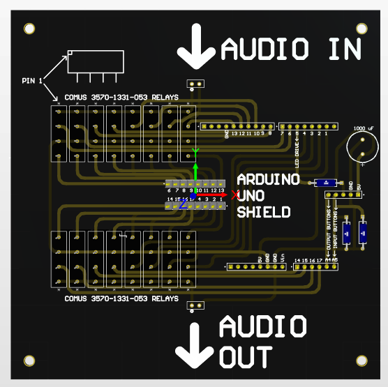
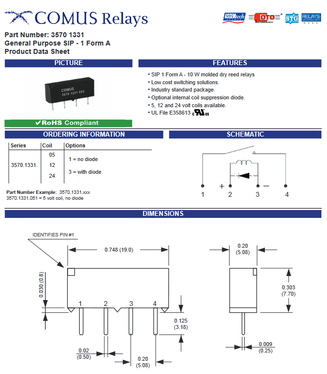
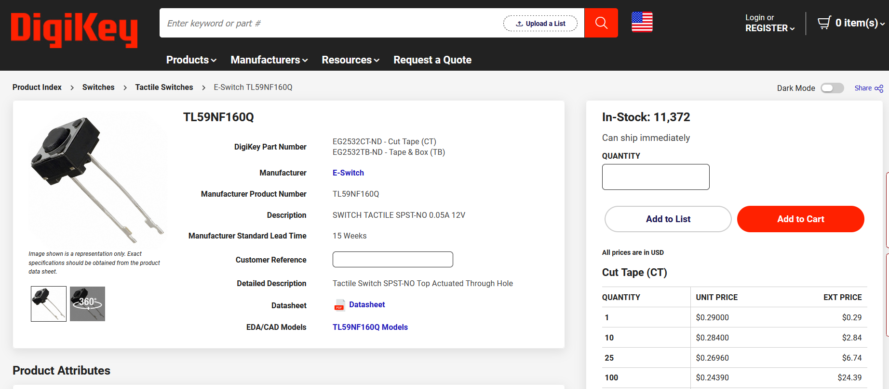
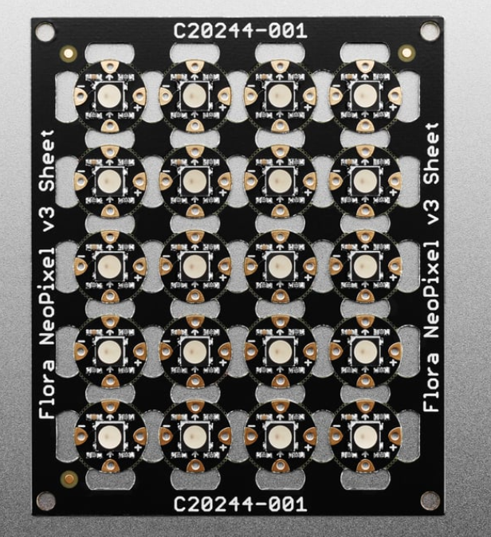
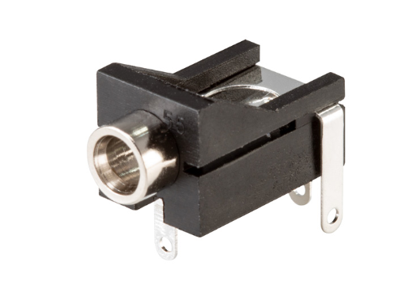
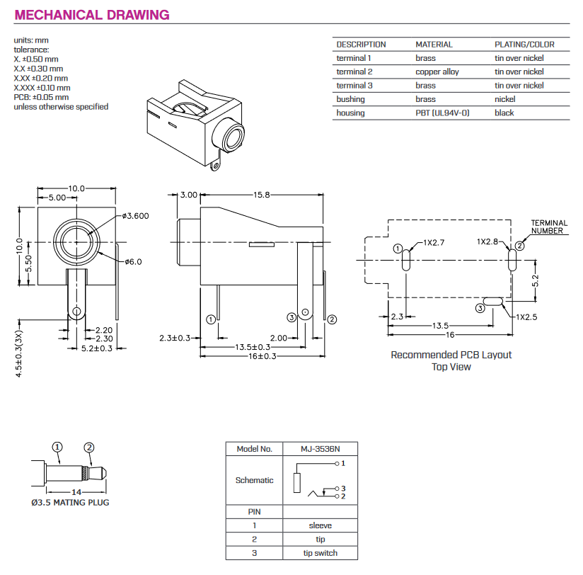

# muxduino

## Arduino Shield multiplexer for audio interface to organic circuits.

This is a platform for discovering neuron-like elements in an arbitrary network of electrodes. 8 relays connect to the input side and 8 relays connect to the output side. This set of relays allows for 256x256 = 65,536 possible ways to connect the signals.  If we assume that there are neuron-like responses to be found in some combination of signal paths, we can hunt for these using software.  Algorithms can be developed to hunt for neuron-like behavior and can be improved over time.  

 - [pcb/top-board-gerbers.zip](pcb/top-board-gerbers.zip)

 - [pcb/muxduino-shield-gerbers.zip](pcb/muxduino-shield-gerbers.zip)

# Bill of Materials

 - [Comus 3570-1331-053 relay](https://www.digikey.com/en/products/detail/comus-international/3570-1331-053/7497099)
 - [Cui Devices MJ-3536N Board Mount 1/8" Audio Connector](https://www.digikey.com/en/products/detail/cui-devices/MJ-3536N/281264)
 - [E-Switch TL59NF160Q Button](https://www.digikey.com/en/products/detail/e-switch/TL59NF160Q/390533)
 - [Flora RGB Smart NeoPixel version 3 - Sheet of 20](https://www.adafruit.com/product/1559)
 - [330 ohm resistor](https://www.digikey.com/en/products/detail/stackpole-electronics-inc/CF18JT330R/1741683)
 - [100k resistor](https://www.digikey.com/en/products/detail/stackpole-electronics-inc/RNF14FTD100K/1706591)
 - [10k resistor](https://www.digikey.com/en/products/detail/yageo/MFR-25FBF52-10K/13219)
 - [1000 uF capacitor](https://www.digikey.com/en/products/detail/rubycon/16PK1000MEFC10X12-5/3563556)
 - [0.1 inch male headers](https://www.digikey.com/en/products/detail/amphenol-cs-commercial-products/G800W268018EU/17083164)
 - [6 and 8 pin socket headers](https://www.amazon.com/Didamx-120Pcs-2-54MM-Stackable-arduino/dp/B074GQ9LKY/)
 - [16 pin DIP sockets](https://www.amazon.com/uxcell-Pieces-2-54mm-Double-Adapter/dp/B00O9YPVAM/)

# CAD Files

## Libraries

 - [pcb/SchlibLafe.SchLib](pcb/SchlibLafe.SchLib)
 - [pcb/PcbLibLafe.PcbLib](pcb/PcbLibLafe.PcbLib)

## muxduino-shield

 - [pcb/muxduino-shield/muxduino-shield.PcbDoc](pcb/muxduino-shield/muxduino-shield.PcbDoc)
 - [pcb/muxduino-shield/muxduino-shield.PrjPcb](pcb/muxduino-shield/muxduino-shield.PrjPcb)
 - [pcb/muxduino-shield/muxduino-shield.PrjPcbStructure](pcb/muxduino-shield/muxduino-shield.PrjPcbStructure)
 - [pcb/muxduino-shield/muxduino-shield.SchDoc](pcb/muxduino-shield/muxduino-shield.SchDoc)
 - [pcb/muxduino-shield/muxduino-shield.step](pcb/muxduino-shield/muxduino-shield.step)

## top-board

 - [pcb/top-board/top-board.PcbDoc](pcb/top-board/top-board.PcbDoc)
 - [pcb/top-board/top-board.PrjPcb](pcb/top-board/top-board.PrjPcb)
 - [pcb/top-board/top-board.PrjPcbStructure](pcb/top-board/top-board.PrjPcbStructure)
 - [pcb/top-board/top-board.SchDoc](pcb/top-board/top-board.SchDoc)
 - [pcb/top-board/top-board.step](pcb/top-board/top-board.step)

## Switch state

The switch state is represented by an integer from 0 to 2^16-1 = 65535. This is a 16 bit number. We divide it into two bytes, the 8 bit input state and the 8 bit output state.  

