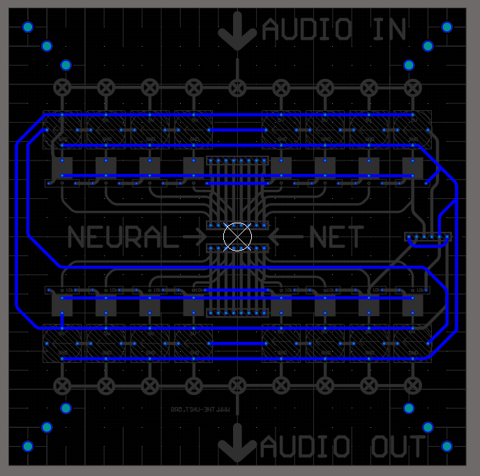
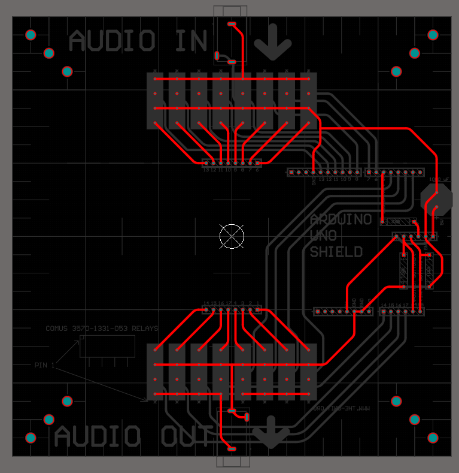

# muxduino

Arduino Shield multiplexer for audio interface to organic circuits

 - [relay]
 - [board mount audio connector](https://www.digikey.com/en/products/detail/cui-devices/MJ-3536N/281264)
 - [button]
 - [single neopixel board]
 - [330 ohm resistor]
 - [100k resistor]
 - [10k resistor]
 - [1000 uF capacitor]
 - [0.1 inch male headers]
 - [0.1 inch header sockets]
